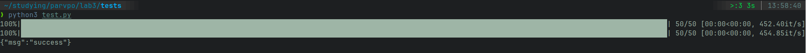
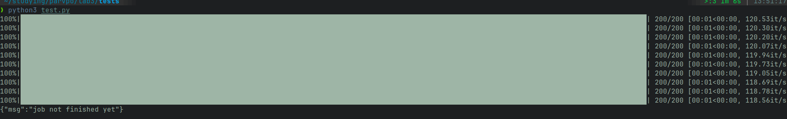

## Никифоров Степан Б21-505 ПАРВПО Лабораторная работа N3 2024

## Реализуемая система
Автоматизированная система сдачи и проверки флагов (специальных значений, уникальных для каждой команды)
1) При сдаче чужого флага команда получает 1 очко, команда, потерявшая флаг -- теряет очко;
2) Команда не может сдать свой флаг;
3) Флаг должен существовать.

## Используемые технологии
flask, rq, redis

## Обоснование брокера
Сдача флага -- трудоемкая задача, необходимо сделать несколько запросов к базе данных, пересчитать очки, поэтому задачи по сдаче флагов складываются в очередь.

## Результаты
При маленькой нагрузке ~100 RPS приложение успело обработать флаги. 

При большой нагрузке ~1000 RPS приложение не успело обработать флаги. 

## Заключение
В результате лабораторной работы были опробованы механизмы брокера и синхронной очереди.
