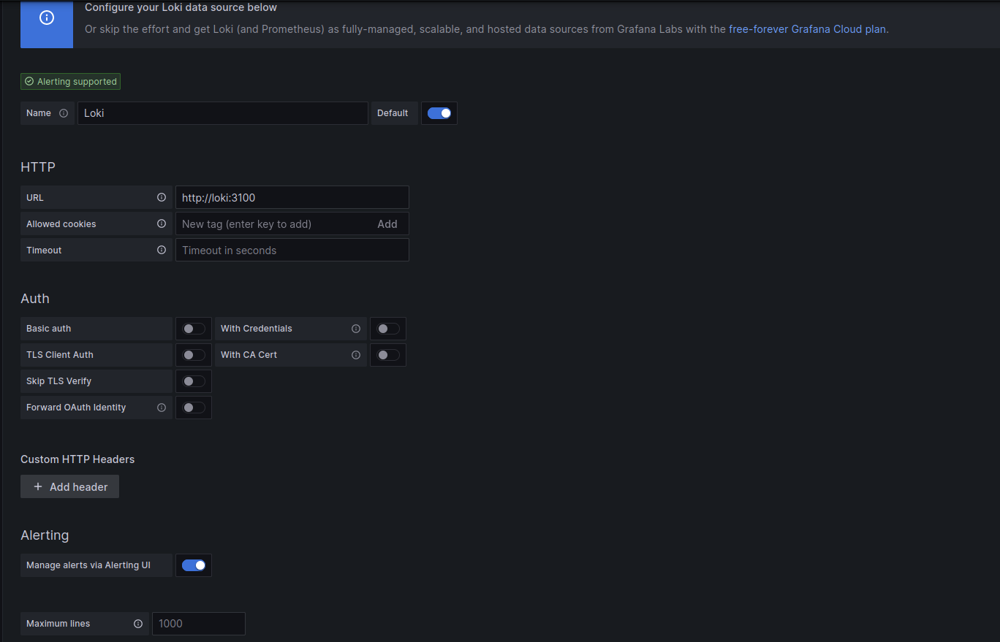
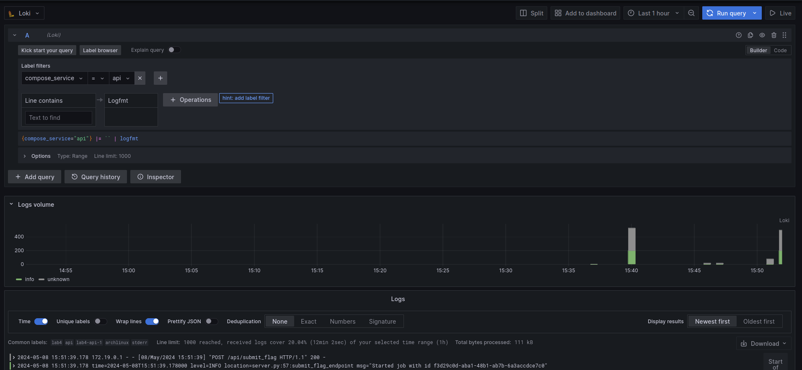
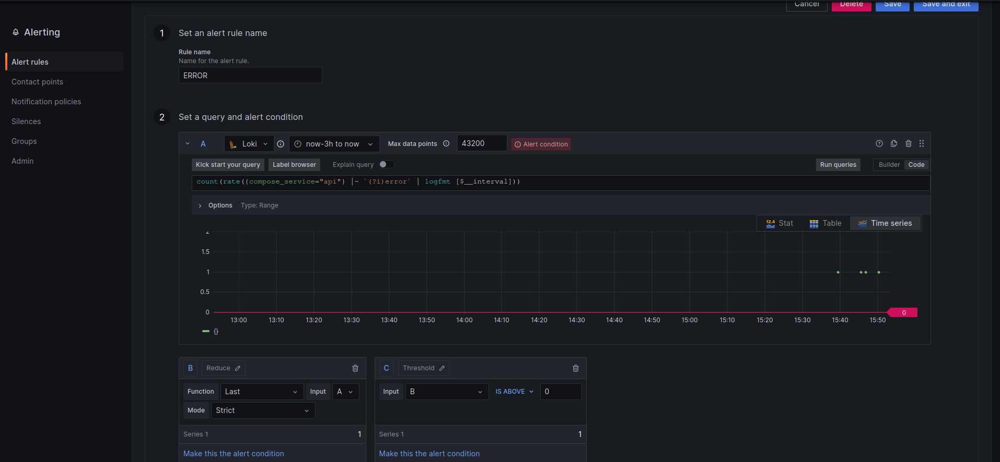
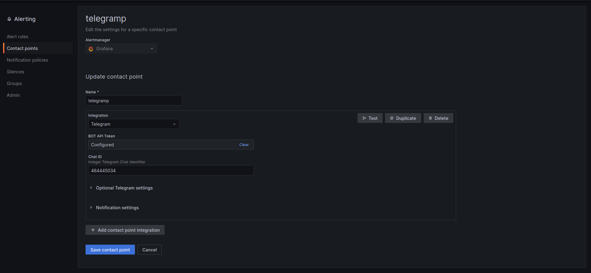
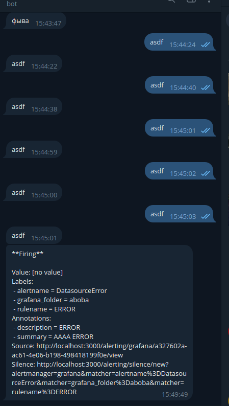

## Никифоров Степан Б21-505 ПАРВПО Лабораторная работа N4 2024

## Реализуемая система
Автоматизированная система сдачи и проверки флагов (специальных значений, уникальных для каждой команды)
1) При сдаче чужого флага команда получает 1 очко, команда, потерявшая флаг -- теряет очко;
2) Команда не может сдать свой флаг;
3) Флаг должен существовать.
4) Настройка логов, нотифаев

## Используемые технологии
flask, rq, redis, grafana, loki

## Результаты
Для докер-демона, был настроен log-driver:
```
{
    "debug" : true,
    "log-driver": "loki",
    "log-opts": {
        "loki-url": "http://0.0.0.0:3100/loki/api/v1/push",
        "loki-batch-size": "400"
    }
}
```
При помощи этой настройки все логи пушатся в loki. 

После подключения loki к grafana



Можно посмотреть логи всех сервисов в Explore



Также был настроены уведомления, если в api возникает ERROR:







## Заключение
В результате лабораторной работы были опробованы система логирования и оповещения.
