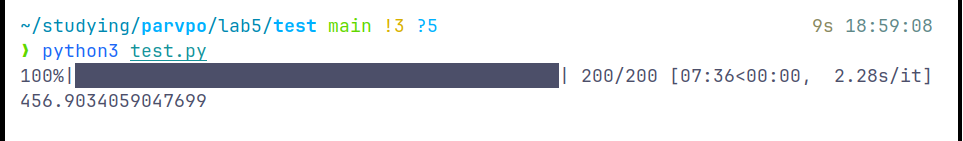

## Никифоров Степан Б21-505 ПАРВПО Лабораторная работа N5 2024

## Реализуемая система
Виджет из примера. По айпишнику выдается температура и курс доллара к данной валюте

```py
def get_info(ip):
    """Хак для того чтобы хоть как то аггрегировать айпишники
    последний октет наверняка будет принадлежать одному провайдеру, поэтому просто кэшируем первые три байта айпишника, считаем что все норм"""
    masked_ip = ''.join(ip.split('.')[:-1])

    cached = conn.get(masked_ip)
    if cached is not None: 
        return json.loads(cached)

    ip_data = requests.get(f'https://json.geoiplookup.io/{ip}').json()

    temp = requests.get(f"https://api.open-meteo.com/v1/forecast?latitude={ip_data.get('latitude')}&longitude={ip_data.get('longitude')}&hourly=temperature_2m").json()
    temp = temp.get('hourly').get('temperature_2m')[0]
    currency_rate = str(requests.get('https://open.er-api.com/v6/latest/USD').json()['rates'][ip_data['currency_code']]) + ip_data['currency_code']

    ans = {'weather': temp, 'usd price': currency_rate}
    conn.set(masked_ip, json.dumps(ans), ex=60*60)
    return ans
```

Обращения на API довольно тяжеловесные, поэтому применяется кэш, который хранится в течение 60 минут

## Используемые технологии
flask, redis

## Результаты
Для тестовой нагрузки был сгенерирован пул из 50 валидных IP адресов. 

Проводилось 200 запросов с случайным выбранным IP из этого пула.
### Без кэша


### С кэшем без прогрева


### С кэшем и прогревом кэша

